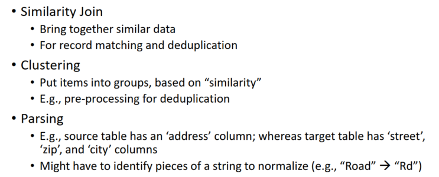
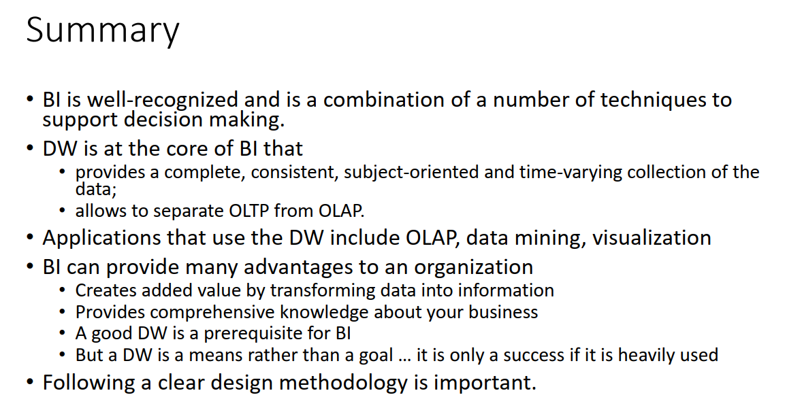

# PA220: Datové systémy pro datovou analytiku 2021/2022

Výpisky/screenshoty z přednášek roku 2021/2022. Informace zde uvedené berte prosím s rezervou, mohla jsem něco vynechat, mohla jsem něco špatně pochopit. Za chyby neručím. I tak ale snad obsahují užitečný přehled látky.

<div><style>.md-toc-h6 {display: none;} .md-toc-h5 {display: none;}</style></div>

[toc]

# Hodnocení

[Zimní semestr 2021/2022]

4 domácí úlohy po 10b, 40b dohromady.

Zkouška písemná, 6 otevřených úloh za celkem 80b.

Dohromady 120b. Na projití třeba 61b.

<div style="page-break-after: always;"></div>

# Přednášky

## **Business inteligence - BI**

**Business inteligence pyramida**


**BI** - proces analyzování dat a prezentování výsledků pro business manažery (aby udělali informovaná rozhodnutí)

Zároveň se BI dá chápat jako sada nástrojů a aplikací pro:

* sbírání dat
* nachystání dat pro uložení a analýzu
* vytvoření a provádění dotazů
* vytvoření reportů a dashboards
* vyzualizaci dat

**BI vs AI** - AI dělá rozhodnutí pro uživatele, zatímco BI jen sbírá data pro informované rozhodnutí uživatele

**BI key problems**

1. *Komplexní nepoužitelné modely:* Mnoho DB modelů je moc těžkých na porozumnění, nezaměřují se jen na jeden jasný business záměr
2. *Stejná data v několika různých systémech*
3. *Data jsou dělaná pro operační systém*: ne pro zpracování BI
4. *Kvalita dat je špatná*: Položky chybí/obsahují neplatné hodnoty/nepřesné, atd. (Navíc null hodnota je velký problém, je vždy potřeba ji transformovat do něčeho stravitelného)
5. *Data jsou “volatilní”*: Mění se v čase, nemáme často historii změn, jsou smazána po určitém čase, atd.

**BI architektura**


Staging data: DB pro výsledek staging, aby se tam nahrála data před tím, než se propíšou do storage (Proč? Můžou ve staging nastat chyby, musely by se řešit rollbacky a tak, toto je o dost snazší)

<div style="page-break-after: always;"></div>

## **Data Warehouse - DW**

Typicky: Jeden velký repozitár pro celou firmu, dedikovaný HW a SW.

Cíl: Jeden zdroj “pravdy”, dat pro analýzu a reportování.

**Uživatelé data warehouse** - business analytici:

* prozkoumávají data pro zisk informací
* tato data uživájí pro rozhodování

Data musí být snadná na porozumnění pro tyto účely. Workloads/access patterns předem nejsou známy. Design řízen daty, ne aplikacemi.

### DW definice


**Subject oriented**: Data jsou v DW organizované tak, aby elementy dat týkající se stejného objektu/události byly u sebe

**Integrated**: DW obsahuje data z mnoha OS organizace a tato data musí být konzistentní (např. jednotky délky - cm vs inch)

**Non-volatile**: Data v DW se nikdy nepřepisuje/nemaže, jsou statická, read only, a zachovaná pro budoucí reporty. Když se stanou změny, probíhá verzování.

**Time-varying**: Data v DW jsou trackovaná a ukládaná, takže reporty se mění během času. DW počítají s dlouhodobým ukládáním dat v rámci let (vs OS, kde to je spíš na bází měsíců)


### Architektura DW - OLTP vs OLAP

**DW**: Integruje data z více zdrojů, subject-oriented, ukládá aktuální i historická data, zvládá multidimenzionální dotazy, vytváří souhrnné data reporty. Není vyžadována normální forma.

**OLTP (Online Transaction Processing)** - day-to-day business operations, operace typicky insert, update, delete, read, z perspektivy databáze typicky krátké operace, většina znich je známa předem.

**OLAP (Online Analytic Processing)** - data pro reporting a dělání rozhodnutí, typicky read-only access, potřebuje archivovaná data, až tak nevadí lehce zastaralá data, z perpektivy databáze dlouhé operace read-only charakteru, dotazy neznáme předem a často komplexní, nutnost projít velké množství dat.


**Alternativní architektury**

- Nezávislé Data Marts bez centralizovaného “Data Warehouse”: “Mini warehouses”, redundance, bez “single source of truth”
- Logické Data Marts (bez explicitního, fyzického data mart)

Data Marts a DW můžou být v jiné lokaci.

### Budování DW

**Top-down approach**

* *Analyzovat globální business požadavky, naplánovat jak vyvinout DW, navrhnout, a implementovat to jako celek.*
* Dlouho to trvá, stojí to extrémní peníze, na konci to ale buď nikomu nepřijde použitelné nebo o to všeichni stejně stratí zájem.

**Bottom-up approach**

* *DW budovat inkrementálně, několik data marts vytvářet iterativně. Každý data mart je založen na sadě faktů, které jsou linknuté na specifické oddělení a jsou zajímavé pro skupinu uživatelů.*
* Vybuduje se jen jeden data mart, začne se používat, a pokud se hodí, udělá se další a třeba s jinými požadavky, pokud se to už vyplatí, začne se budovat centrální DW, popř. virtuální centrální DW. (Top-down prvně vytvoří centrální DW a pak teprve kouká co s tím.)

### ETL process

Extract - Transform - Load


### Připravení DW

* Query-driven - data integrated on demand (lazy)
  PLUS: up to date data, bez duplikace
  MÍNUS: pomalé, komplexní, neefektivní pro frekventní dotazy, data loss u zdrojů
* Warehouse-driven - data integrated in advance (eager) - toto se používá
  PLUS: dobrý výkon pro hodně dotazů, nepřekáží lokálnímu processingu
  MÍNUS: duplikace dat, nejsou k dispozici nejvíc aktuální data

### Životní cyklus DW


1. analýza nákladů, požadavků, týmu, rizik, jestli je to potřeba…
2. analýza možných architektonických řešení, nástrojů, přístupu
3. opakující se iterace s vyvinutím data mart, pokud první uspěje, je otevřená cesta dalším

### Modelování DW

Nechceme maximálně normalizované, spíš je snaha, aby byla jedna tabulka, ta nejdůležitější, “sink”, kde bude všechno relevantní info a odkazy na přímé linked informace.

Zaběhlé modely: star schema, fact table, dimension table…

<div style="page-break-after: always;"></div>

## **Data Warehouse Modelling**

**Design klasické transakční databáze**

* OLTP, normalizovaná, důležitý výkon v oblasti rychlého insert a update
* při query vracen jen zlomek dat
* velmi důležitá je konzistence dat

vs

**Database for Data Warehouse Desigg**

- důležitý performance získání dat rychle (rychlost insertu/update není důležitá)
- zamykání není issue (DW provádí read-only oeprace)
- v dotazu navráceny velké sety dat

### Dimensional Modeling

“Návrhová technika pro databáze, abychom nejlépe zvládali požadavky koncových uživatelů pro náš datový sklad.”

Dimenze = “stanovené hodnoty” (jméno zákazníka, datum, číslo objednávky)
Fakta = “naměřené hodnoty” (počet, teplota, cena)

* data denormalizovaná pro snažší reporting
* výsledný model reflektuje typy dotazů, které uživatelé chtějí provádět, ne na tom jak by se ta data např. primárně sestavovala v systému - chceme co nejlépe uspokojit plánované dotazy/reporty (to je ten hlavní důvod proč to děláme, after all)
* výkon operací na data maintenance je druhořadý

**Business process measurement events**

Když chceme uložit informace o business procesech, ukládáme nějaké “business process measurement events” - lze ukládat mnoho položek a různý level detailů, otázka je co je potřebova pro náš konkrétní účel (např. pro EET není potřeba zaznamenávat jednoltivé položky nákupu).


Takováta data se běžně analyzují např. v tzv kontingenčních tabulkách (pivot tables) v spreadsheet SW.

#### Dimenze

* Popisují business events (např. prodej produktu). Ty položky, podle kterých by uživatel mohl chtít filtrovat, řadit nebo seskupovat/agregovat (např. data, číslo uživatele, číslo obchodu, …)
* Mnoho dimenzí má hierarchii (city-> region -> state -> country), občas i více (date -> day -> month… date -> weekday). Např. regionální celek, čas, …
  Nejnižší level hierarchie - *atomic grain* (atomické zrno/jemnost)
  Nejvyšší level hierarchie - typicky, v modelování podpůrné slovo “ALL”
* Pokud v nějaké dimenzi uchováváme pouze jednu položku, v tabulce by byl jeden sloupeček, hovoříme o tzv. **degradované dimenzi**. Reálně se potom pro takovou položku nemusí modelovat samostatná dimenze, ale ponechá se ve faktové tabulce. Např. číslo objednávky.
* Typicky 4-15 na faktovou tabulku. Příliš dimenzí je bad - pravděpodobně nejsou nezávislé, takže by měly být kombinované, plus to výrazně navyšuje prostorové náklady na faktovou tabulku.
* **Časová dimenze**: Typicky používá datum ve formě int. Time of day bývá samostatná dimenze (kvůli tomu, že dokupy by to bylo příliš mnoho možností). Často má několik klíčů a ostatní fakt tabulky co do toho ukazují podle potřeby.

#### Fakt

fact/measure - měřitelná metrika, které je popsána dimenzemi - např. množství objednávky, cena. Často věci, které chceme sumarizovat/zprůměrovat atd.

Obvykle máme výrazně víc dimenzí než faktů.

Faktové tabulky mají v sobě fakty se stejnou granularitou.

Někde null může být, někde je obvykle nechceme (např. u id obchodu co to prodal, protože pak by byla porušena granularita - ale i to občas, vzácně, může být okay, pokud by to byla nějaká tabulka ve které by bylo narvaný víc druhů dat [?] - ALE normálně chceme stejnou granularitu)

Druhy faktů:

* transaction (event) facts - fakt pro daný business event, typicky se na tom dají dělat součty
* snapshot facts - zachycuje aktuální stav (např. stav nádrže auta)
* kumulativní snapshot fakt - zachycuje aktuální stav u kumulativních faktů, např. počet prodejů produktu k dnešnímu dni)
* “fact-less” fact - neukládaný fakt, jde o kombinaci klíčů (pouze kdo kam atd. nám stačí jako záznam o tom bez dalších faktů)

Rozlišujeme různé druhy faktů:

* agregované fakty - jednoduché numerické agregace atomických faktů v tabulce, pro urychlení dotazů
* konsolidovaný fakt - hodnota, která je “vyrobená” z více zdrojů, z více business procesů například, např. skutečné prodeje zkombinované s předpovědí prodejů
  (takže btw nějaká dimenze může být využívána z více tabulek, data martů…)

Každý typ faktů odpovídá na jinou otázku od uživatele.

#### Granularita faktů (Zrno)

Důležité rozhodnutí, které nejde udělat bez toho, abychom znali nějaké dotazy, které nad tím budou prováděny.

Málo detailů - problém zjsitit data, příliš mnoho detailů - výkon not stonks. Například v domácí úloze, kde bychom sice mohli mít v time dimenzi čas po milisekundách, ale to by bylo zbytečné když my potřebovali max minuty a zbytečně by to rozšířilo tu tabulku o mnohonásobně víc řádků.

#### Measures

Reprezentuje fakta které uživatel chce studovat a analyzovat, např. suma sales.

Rozlišujeme tři funkce:

* fully-additive measures - v pohodě jde agregovat pomocí sum (např. sales, profit, …), často u transaction (event) facts
* semi-additive measures - nad některými dimenzemi nemůžou být agregovány (např. stav nádrží v mnoha zařízeních nejde agregovat přes čas, ale jde agregovat napříč vozidly), často u shapshot facts
* non-additive measures - prostě nejde sčítat (např. poměr, cena výrobku, …)

#### Surrogate key

Surrogate key zavádíme v situaci, kde bychom sice mohli pro dimenzi použít jako primární klíč nějaký klíč z originálního systému (např. car key z domácí úlohy), ale reálně je lepší se takovému použití vyhnout. Důvodů je několik: Zdrojový systém se může změnit/mohla v něm být chyba, my to nechceme zpětně měnit, chceme statické; když agregujeme databáze, které každá generovala vlastní primární klíče, může nastat kolize, …

Takže se vytvoří nový umělý klíč - surrogate klíč.

#### Redundance v DW


### Star schema


Obsahuje primární klíče a surrogate keys (místo primárních klíčů z původních tabulek).

### Snowflake schema

Výsledek snah normalizovat Star schema. Výhoda je šetření místa (ale reálně se šetření místa vyplatá jen na faktové tabulce, aka té prostřední, té co zkoumáme primárně - a toto dělá i star schema). Může být zase škodlivé pro výkon (lot of joins), moc se nepoužívá.

### Postup dimenzionálního oddělování

1. Identifikovat co chci - tedy business process, který řešíme (např. prodej)
   Dobré použít modelovacích nástrojů pro grafickou reprezentaci, např. UML.
2. Stanovit zrnitost (granularitu)
   Granularita popisuje na co se model má vlastně soustředit.Pro klarifikaci co to je, je dobrý vzít ten centrální proces co řešíme a *popsat ho jednou větou* a z toho vyjít. 
3. Identifikovat dimenze
4. Identifikovat fakta

**Seven W’s of DW Design**: How, What, When, Where, Who, How many/much, Why

Toto pak dost často kickstartne další dotazy na další informace, pomáhá soustředit se na jeden proces v jeden čas, good postup.

**Data Warehouse Bus Matrix**

Nalezení sdílených dimenzí, dimenze = sloupec, fact table = řádek, pomáhá určit si co co potřebuje a co se sdílí.


### Slowly Changing Dimension (SCD)

Hodnoty dimenzí se mohou měnit. Jak se se změnou systém vyrovná záleží na tom jak moc nás zajímá historická hodnota. Proto si u každé dimenze chceme určit, který typ SCD to je a podle toho s tím zacházet při potřebě upravit záznam.

[Jednotlivé typy říkal, že po nás nebude chtít nazpaměť.]

* **SCD 1. Overwrite**: Prostě přepsat hodnotu.
* **SCD 2. Add New Row**: Udržení všech historických hodnot. přidá se pokaždé nový řádek (plus je zaveden třeba ještě extra sloupeček nebo tak), například umístění obchodu se změnilo - přidá se valid_from, valid_to sloupec. A pak je ještě třeba vyřešit jak udělat že valid_to nemá hodnotu - null ugly? Třeba dát max hodnotu.
* **SCD 3. Add new attribute**: Nová hodnota se napíše kam má, a stará uloží v novém sloupci (např. prev_store_region).
* **SCD 4. Add Mini-Dimension**: Pro rapidně měnící se atributy v dimenzi. Zavede novou mini-dimenzi, např. ve které je jen změněný region a od kdy dokdy. (Nová mini dimenze je napojená na faktovou tabulku zvlášť, ne přes původní dimenzi.)
* **SCD: Kombinace**
  * SCD 5: Kombinace 4 & 1: v podstatě už normalizace, v půvdoní dimenzi je číslo z minidimenzi, kam jsme to přesunuli, není třeba mini dimenzi extra napojit na fact table
  * SCD 6: Kombinace 1 & 2 & 3
  * SCD 0: Ignorujeme změny - hodnota se nemůže změnit

<div style="page-break-after: always;"></div>

## **Implementace a dotazování**

### Multidimenzionální model


Data rozdělena na fakta a dimenze. Fakta mohou být agregovány (např. sales price), redundance nevadí, fakta jsou v podobně *multidimenzionální kostky* (spíš pro představu než že by to tak vždy bylo).

#### Multidimenzionální kostka


Na obrázku dimenze x - time, y - product, z - city.

Může mít **mnoho** dimenzí, většinou více než 3 - často se používá pojem *hypercube*. Teoreticky není limit dimenzí, typicky máme 4-12. Ale jen 2-4 můžou být prohlíženy naráz, dimenze bývají v dotazech redukovány skrz projekci/agregaci.

Kostka se skládá z **buněk** - buňka je kombinace hodnot z dimenzí, buňka může být prázdná.

*Hustá kostka* - má mnoho neprázdných buněk, *řídká kostka* - má mnoho prázdných buněk.

#### Dimenze

Základem multidimenzionálních databází. Ostatní typy databází je nepodporují.

Dimenze používáme pro výběr dat, seskupování dat na žádáné úrovni detailu.

Hodnoty dimenzí mohou mít řazení, které používáme pro porovnání dat v kostce. Např. číselné hodnoty mají implicitní porovnání, to samé datum.

#### Schéma

Na popsání multidimenzionálního modelu není dobře definovaný standard. Dá se použít například takováto notace, popř UML-ish notace, atd.


### OLAP systémy


Jak OLAP realizovat? Můžeme vzít v podstattě relační databázi a vytvořit relační OLAP -> ROLAP. Nebo udělat special Multidimenzionální OLAP (MOLAP). Popř. hybridní HOLAP.

**Relační OLAP (ROLAP)**

Ukládání dat do relační databáze a simulace muldimenzionality díky speciálním schématům.

**+** škálovatelné, flexibilní, indexy, materializované views, nové performance++ techniky z MOLAPu

**-** náročnost na paměť (často 3-4x horší než MOLAP), čas odpovědi meh

**Muldimensionální OLAP (MOLAP)**

Fyzicky ukládá už zpracovaná muldimenzionální data pro doručení konzistentí a rychlé odpovědi pro uživatele. Např. v multidim. poli.

**+** méně paměti třeba, rychlejší queries

**-** nic moc škálovatelnost, nejde použít k ničemu jinému než k analytice - není flexibilní, nemůže používat existujicí investici do databází (jako ROLAP), not really open technology

**Hybridní OLAP (HOLAP)**

Detailní data ukládaná v relačních tabulkách (ROLAP), agregovaná data uožená v muldiminezionálních strukturách (MOLAP).

**+** šklálovatelná (jako ROLAP), rychlá (jako MOLAP)

**-** vysoká komplexita

**Relační OLAP kostky**

Dva typy dotazů:

* zkoumání obsahu dimenze (např. SELECT DISTINCT…)
* agregační dotazy na sumarizaci dat faktů (např. SELECT … SUM … FROM … WHERE … GROUP BY …) - toto tu kostku zkomprimuje do pouze pár dimenzí, které zkoumáme

Rychlá interaktivní analýza velkého mnozžství dat.

#### Dotazy v OLAP


**Roll-up** 

Získání “overview”, jde o zploštění kostky do méně dimenzí (např. vezmeme statistiky prodeje napříč všemi roky)

* **hierarchický roll-up** - jedeme po hierarchii výš, takže např místo dělení po dnech uděláme po týdnech, BTW na vrchu každé dimenze je ALL, nejvyšší level diemnze
* **dimenzionální roll-up** - čistě na faktové tabulce tak, že vypustíme jednu dimenzi (např. odignorujeme různé klienty, podle kterých to předtím bylo také děleno)

**Drill-down** 

Více detailů - rozdroení dimenze na ještě menší granularitu, např. z dimenze času po rocích chci rozdělení na měsíce

* neboli roll-down, je to opak k roll-up, je to obtížnější než roll-up
* de-agregační operace, z vyšší hierarchie jdeme na nižší NEBO přidáme novou dimenzi (např. zavedeme dělení podle časové dimenze, co tam předtím vůbec nebylo)

**Slice/dice**

Vybereme z jedné dimenze jen jednu možnost (např. vezmeme pouze rok 2000 z časové dimenze)

Dotaz WHERE v SQL pro slice, range SELECT pro dice.

Slice - vezmeme přímo jednu možnost v dimenzi, dice - vezmeme range.

**Pivot table**

(= kontingenční tabulka), aka crosstab - basic excel tabulka například.

Přerovnání dat pro účely zobrazení. Nejjednoduší je vybrání dvou dimenzí pro agregaci nějaké hodnoty. Efektivní jen pro hustá data.


**Kontigenční tabulka (pivot) v ROLAPu**


ALL je zástupná hodnota pro všechny možnosti. Informace stejná jako v pivotu normálním, je více efektivní na použití místa pro řídké hodnoty (řádek tam prostě není, zatímco v klasik pivotu tam furt je ale máme prázdné buňky).

**Další operace**

* agregační funkce
* ranking, porovnávání
* drill across, drill through, zhušťování dat (partitioned outer join)

### SQL & OLAP

Nové SQL dotazy pro OLAP - GROUPING SETS, ROLLUP, CUBE (abychom nemuseli dělat yummy destíkové selecty). Nové agregační funkce na věci co normálně by v SQL nešly (třeba medián, percentily, atd.).

[praktické ukázky SQL, v tomto docu víceméně vynecháno, jen na konci jsou uvedeny některé příkazy]

<div style="page-break-after: always;"></div>

## **Indexování a optimalizace**

Problém: Často čteme obrovské množství dat kvůli malému množství, které nás z toho zajímá. Chceme data vyfiltrovat ve faktové tabulce co nejvíc lze (aby byla low selectability).

### Typy indexů


ad Block-Range Index - Může pomoci ve speciální situaci, např. když máme bool hodnotu, jen dvě hodnoty, třeba muži/ženy na fakultě a chceme vyfiltrovat muže, blok-range index si pamatuje, jestli v bloku dat obsahuje aspoň jedno true. Pokud tam máme ženy na začátku muže potom, tak velmi rychle zjistí, že prvních pár bloků vůbec nemusí číst a přečte jen bloky, kde má aspoň nějaké true.

Indexy můžeme kombinovat (použít dva a dostat “průnik”).

**Sekundární index** vs **primární index** - některé systémy, např. postgress, primární ani neumí.

* **primární index** - data mám přímo v indexu, data mám uspořádané v pořadí ve kterém je index, potom jsou nad tím rychlé lineární operace (prostě jen se jede lineárně)
* **sekundární index** - index je jen struktura pointerů na ty záznamy, ty můžou být v jiném souboru, libovolně rozdrbané, může vést i k hodně čtením, a ten dotaz může být stejně pomalý (když je vysoká selektivita například)

#### B+ stromy

Limitované, jen pro 1d data. Velmi efektivní struktura pro updatování.

Btw B strom není binární, ale enární strom. B+ strom znamená, že má záznamy až v listech.

#### UB-Tree

Používá B* stromy (B strom co má naplněnost na 2/3, není omezen na záznamy v listech) a přidává Z-curve na linearizování n-dimenzionálních dat


Dělá zanořující Ztkový shape (na nejvyšší úrovni i každé nižští, takže jakoby 3 Z úrovně na tomto obrázku). Pořád to má “chyby”, kdy jsou vedle sebe sice v pořadí ale v 2D prostoru ne a naopak, ale má to rozhodně větší “přesnost” blízkosti v pořádí == blízkosti ve vážně 2D prostoru než B+ strom.

Z-curve zajišťuje dobrou výkonnost pro range queries, protože za sebou následující data jsou (většinou) podobná data).

Z-value se snadno dopočítá podle x a y:


Barvičky jsou bloky.

[lecture04 slides 9-10 algoritmus na range query, ale to nemusíme umět]

#### R-Tree

Jako B-stromy - data v listových uzlech, uzly jsou reprezentovány jako minimální bounding rectangles (nejmenší opsané obdélníky), high-balanced structure. Přidává tím možnost více-dimenzionálních dat.


Nevýhoda - overlapy mohou nastat, hlavně ve více dimenzionálních datech jich může být fakt hodně a musíme při hledání projít více podstromů než jen jeden při cestě.

Proto se dost řeší optilmalizace splitů - jak rozštěpit data, aby je ten opsaný obdélník obepsal s co nejméně volným místem, co nejkompaktnější.


#### R+ strom

Řeší overlapy tak, že pokud je tam overlap, rozdělí to na dvě části a uloží do dvou nodes, takže prohledávání je vždy jen jednou cestou - logaritmická složitost.


Obrázek: G, které overlapuje, se rozdělilo a uložilo do node A i do node P.

### Bitmap index

Dobré pro data s malým množstvím možných hodnot (např. pohlaví, velikost oblečení, …).

Bitmap index pro jeden atribut je:

* kolekce bitmaps (bit-vectors), je tam tolik vektorů kolik je různých možných hodnot, kde jsou v každém 0 pokud hodnota není ta jeho, 1 pokud je
* bitmap je array ukládájící jednotlivé bity, délka je kardinalita relace (počet záznamů i guess)

Záznamům se alokuje permanentní pozice v bitmap indexu. Mapování mezi record number a record address.

Vymazání záznamu: ve faktové tabulce - tombstone, v indexu se bit clearne.

Vložení záznamu: bitový vektor se rozšíří.

Update: Vymazání a vložení záznamu. Ale my ve warehousu updates stejně moc neděláme.

Queries: kombinace OR/AND

Bitmapové indexy by měly být použity když je selectivity *low* (když je málo typů hodnot co tam jsou, protože pro každou value se vytváří vlastní index)

**Multi-component bitmap index**

Transformuje hodnoty do více dimnezní a projectneme je. Intersekce projekcí nám dá originální hodnotu. Npaříklad Měsíc bude mít hodnotu mezi 00 a 11, pokud si měsíc rozdělíme na kvartály.

**Range-encoded Bitmap Index**


Pro narození člověka se dá 1 do toho měsíce a všechny “vyšší”. Pro range kdo je narození od března do srpna se stačí podívat na sloupečky Aug a Feb - ti, kdo mají už 1 v Aug ale ještě ji neměli ve Feb, jsou narození v Mar-Aug.

### Data Partitioning

Rozbití dat do částí, co se “nepřekrývají”. Může korespondovat s granularitou dimenze. Vertikální (podle sloupců; pokud máme sloupce které jsou často přistupované; trochu obtížnější, často třeba ručně) vs horizontální (podle řádků).


Vylepšuje:

* business query performace (minimalizuje množství dat k prohledání)
* data availability (backup/restore může běžet na levelu partitionů)
* database administration (jednodušší přidávání nových sloupců do tabulky, archivace, loading, …)

Přístupy:

* logical partitioning by some data logic
* physical partitioning - prostě naseká nahrubo podle velikost bez ohledu na to jak moc to dává smysl rozdělit

Implementace na úrovni aplikace nebo databázového systému

**Horizontal Partitioning**


**Vertical Partitioning**


Join Optimization


Pro optimalizaci je dobré se dívat na velikost tabulek a na filtry, které na ně aplikujeme (např. vyhnout se dělání joinu prvně na big af tabulkách, když potom by se to nějak vyfiltrovalo).


OLTP heuristiky joinů nejsou příliš vhodné pro DW. Lepší může být použít **cross join**. 

Pokud by i cross join byl příliš velký, lze použít **intersect partial join** (lze použít když všechny FK v dimenzích jsou indexované, je to prakticky *semi-join*).

[Tyto joiny by to chtělo možná podrobněji.]

### Materialized Views

Views jejichž “tuples” jsou uloženy v databázi. Dovolují rychlý přístup (trochu jako cache vysoké úrovně).

Problémy MV:

* Výběr MV: Nad čím je udělat, jaké indexy použít? Vytvoření view se musí vyplatit.
* Použití MV: Jsme schopni použít dané MV na zodpovězení dotazu?
* Údržba MV: Jak často bychom měli aktualizovat MV aby byly konzistentní s underlying tabulkami? A jde to dělat inkrementálně?

V DW často používáme MV na uložení výsledku nějaké agregace. Nelze agregovat vše, musíme zvolit co se vyplatí agregovat. To můžeme volit staticky nebo dynamicky (MV set se sám adaptuje podle používaných queires).

**Statická volba**

* DB administrátor nebo algoritmus v jeden moment zvolí, set MV pak zůstává jak je dokud se nezvolí jiné
* Výběr podle “benefitu”, který se počítá na základě *cost function*, která zahrnuje query costs, statistický výpočet frekvence query, cenu na aktualizaci/maintenance MV
* Nevýhody: Těžko se předvídá všechny možné často používané queries, query co se teď často používá se nemusí používat v budoucnosti, modifikace dat vede k větším nákladům na maintenance.
* Může se hodit staticky nastavit část MV staticky pro queries, které se určitě budou provádět, a zbytek nechat dynamicky.

**Dynamická volba**

* Monitoruje prováděné queries, udržuje *materialized view processing plan* (MVPP) zahrnující nejčastěji prováděné queries, pomocí toho rozhoduje které views budou materializované a reorganizuje existující views.
* Cost function zahrnuje: čas posledního přístupu k MV, frekvence dotazu na něj, velikost MV, cena nové kalkulace/aktualizace, počet queries odpověděných MV, počet queries které by mohly být odpověděny tímto MV.

**Udržování MV** - různé přístupy:

* **re-computation** - recalculated from the scratch
* **incremental** - updated by new data, not easy to implement
* **immediate** - update MV je součástí transakce která updatuje underlying data (MV is always consistent, but updates are slower)
* **deferred** - později updatenuté v samostatné transakci (scales good for many views bez zpomalování updatů dat, ale views jsou dočasně nekonzistentní); může být *lazy* (refresh when next query on view is done), *periodic* (snapshot, refresh periodically, some queries may be answered by old MV before it happens), nebo *event-based* (eg. refresh after x updates to underlying data)

<div style="page-break-after: always;"></div>

## **ETL proces**

Ve většině DW je ETL nejnáročnější proces (až 80% vývoje).

ETL - Extract $\rightarrow$ Transform $\rightarrow$ Load (vs ELT, kde je to naopak)


**Data staging area** - transit storage pro data v procesu, probíhají zde transformace/čištění dat. Pár sekvenčních operací nad velkým objemem dat. Není potřeba locking, logging, etc. Dokončené dimenze jsou nakopírovány do relevantních data marts.

ETL probíhá na setupu DW a potom slouží na propagaci změn v datech.

Typy procesů v ETL se vybírají podle: **overhead** na DW a source, **data staleness** (jak moc vadí že data nejsou fresh určitou chvíli), **debugging/failure handling** (s čistě online/stream-based mechanismy může být problém najít chybu), různé procesy pro **různé typy dat** (některé mohou vyžadovat periodic refresh, některé jsou na to moc velké, atd.).

**Detecting data change**: **Audit columns** (eg. last modified timestamp, flag set on row update, unset on load to DW), **full diff** (keep old snapshot and do diff with current version, resource-intense), **database log scraping** (may get messy).

Není dobré snažit se všechno udělat naráz. Lepší je jít krok za krokem: Kopírovat data 1:1 do staging area $\rightarrow$ vypočítat delty (při inkrementálním loadu) $\rightarrow$ handle versions and DW keys (versions only if SCD) $\rightarrow$ complex transformations $\rightarrow$ load dimensions $\rightarrow$ load facts.

**Data cleansing**

Normalizování a čištění dat.

* Chceme data co jsou - přesná, úplná, konzistentní, unikátní.
* Řeší normalizaci dat, konflikty/inkonzistence, spelling errors, duplicates match.




* detekování nekonzistencí - column screen (je tam hodnota? má dobrý formát?), structure screen (dávají tyto informace dohromady smysl? např. adresa), business rule screen (dávají data smysl vzhledem k business? např. je počet objednávek zákazníka reálně dosažitelná hodnota?)

**Vylepšení data quality:**

* “data stewards” zodpovědní za data quality, jejichž práce zahrnuje manuální inspekci a korekce
* DW-controlled improvement - nahradí defaultními hodnotami chybějící data, nebo nechá note pro data steward, atd.
* source-controlled improvements, nebo vlastní programy na quality check
* ne všechna “divná” data je třeba opravit, někdy to mohou být reálné výkyvy co by chtělo předat dál managementu

**Prepare dimensional tables**


Problémy:

* “upsert” - update if exists, else insert, zabíjí výkon (lepší separovat update a bulk-load insert)
* generování a hledání dimension surrogate keys - dobré udržovat “dim cross ref” table v paměti nebo back-end DB
* dimense musí být updatovány před faktovou tabulkou

**Loading data performance tips**

* turn off logging, disable indexes and reindex afterwards, pre-sort data, truncate table when loading from scratch, enable “fast mode”, make sure data is correct, temporarily disable integrity control, parallelization

<div style="page-break-after: always;"></div>

## **Big Data Analytics**

**Nature of Big Data**

* Volume (x10 every 5 years)
* Variety (different data, structure, text, multimedia, …)
* Velocity (continous data from from sensons, social networks, …)
* Veracity (with different sources, it gets more difficult to maintain data certainty)
* Real-time processing

**Necessities for Big Data Analytics**

* dostatečná infrastruktura na jejich processing (batch/stream) a uložení (key-value or column stores)
* algoritmy pro big data (data integration, reporting, analytic functions, machine learning)

V Big Data spíše horizontal scaling (adding more machines) než vertical (increasing computing power of the existing machines).

### Nové platformy

* HDFS & MapReduce (eg. Hadoop)
* distributed stream processing (eg. Storm)
* column storage (eg. Vertica)
* NoSQL platforms (eg. HBase)
* in-memory DBMSs (eg. VoltDB)

[následující věci jsou popsány hodně ve zkratce, pokud vůbec, v přednáškách je více infa]

**Hadoop platform** - SW library for distributed processing of large data sets (across computer clusters), HDFS, MapReduce

* **HDFS** - distributed high-throughput file system, files in chunks (typ. 64MB), data replicated atthree machines (one - name node/master, two others - data nodes/chunk servers, master keeps track of metadata, client polls master, it requests relevant data from data node), write-once files (expect for append, truncate)

**Distributed computatiom platforms** - batch processing (MapReduce, Spark), stream processing (Storm, Spark Streaming)

* **MapReduce** - programming model for distributed data processing, cooperates with a distributed file system; 3 phases: **map** phase (data transformation), **grouping** phase (automatic by MapReduce framework), **reduce** phase (data aggregation)

  **Map function** simplifies the problem, input: single data item, output: zero or more (key, value) pairs. Keys do not have to be unique. Map phase applies map function to all items.

  

  **Grouping**: Key-value outputs are grouped by key and are consolidated into a single list (key, list).

  

  **Reduce**: Combine the values for each key. Input (key, value-list), output (key, value-list) with zero or more output records.

  Příklad: word count. Map přiřadí každému slovu (“slovo”, 1), shuffling posbírá všechna stejná slova do listu, a reduce ze seznamu (“slovo”, [1,1,1]) udělá (“slovo”, 3)

* **Storm** - real-time computation, scalable, fault-tolerant. Algoritmus je jako acyklický graf s hranami co mají směr. Nodes v něm jsou “spouts” (data source, obdélník), “bolts” (processing nodes, elipsa), a hrany jsou streams of data tuples.

**Apache Spark** - unified analytics engine for large-scale data processing, high performance for both batch and streaming data. 100x faster than Hadoop.

**Distributed Storage Platforms** - *key-value stores/NoSQL databases* (structured/tabular data model, flexible schema, horizontal scaling, no ACID, no joins, key = identifies, row, value = multidimensional structure) [looks like JSON]; *column stores* (relational data model, read-optimized, relaxed consistency on reads), *real-time databases* (NewSQL, ACID guarantees, row-orineted storage, main memory db, fault-tolerance by node replication)

**Distributed Data Warehouse**

* **Hive** - data warehouse for large datasets, suports indeximg, manages and queries data using HiveQL (converts them to map-reduce jobs)
* **Kylin** - OLAP for big data, query engine translation, precalculates aggregations

**Advanced Analytics**

* **Apache Mahout** - scalable machine learning library, based on Hadoop, Spark, aimed at clustering, dimensionality reduction, classification
* **Project R** - platform for statistical computing and visualization
* Advanced analytics in real time: event processing (tracking streams to detect events, even = change of state, anomaly, …, derives conclusions), complex event processing (multiple sources, pattern detection, correlation, filtering, aggregation, extension to SQL - StreamSQL)

**Apache Hive** - system for querying and managing structured data build on top of Hadoop, Map-Reduce for execution, HDFS for storage, structured data with rich types (structs, lists, maps), direc query data from different formats, allows embedded scripts, rich metadata. 

**Apache Impala** - query engine running on Apache Hadoop, circumvents MapReduce to directly access data. Low-latency SQL queries to data stored in HDFS and Apache Base, same metadata, SQL syntax (HiveQL) and user interface as Apache Hive.

<div style="page-break-after: always;"></div>

# SQL příkazy uvedené v přednáškách

[Spíš jen přehled než vysvětlení]

```sql
-- IN GROUP BY SECTION
grouping sets(groups_we_want); -- eg. grouping sets((a,b), (a,c))
-- contains something called GROUPING_ID that can be used to identify
-- which group it belongs to for advanced operations
GROUPING_ID()
rollup(what, we, are, rolling, up); -- order matters!
cube(what, we, want, cubed);

-- IN BETWEEN SELECTS
union

-- WINDOW FUNCTION (in SELECT)
over + partition by -- over has 3 subclasuses - partitioning, ordering, aggregation grouping
-- eg. SELECT avg(sales) OVER (PARTITION BY region ORDER BY month ASC ROWS 2 PRECEDING) as something;

-- RANKING OPERATIONS
RANK() --OVER something
DENSE_RANK() -- OVER something
PERCENT_RANK()
CUME_DIST() -- cummulative distribution
NTILE(num) -- splits data into N buckets and assigns number to data, NTILE(4) - quartile, NTILE(100) - percentile

ROW_NUMBER()

-- WINDOW FRAME
first_value(expression) -- OVER something
last_value(expression)
nth_value(expression)
LAG(something, offset) -- OVER something, lags data, can be used to compare value to value from x rows before (eg. homework last connection time)

-- EXTRA JOINS
cross join
intersect partial join
```

<div style="page-break-after: always;"></div>

# Shrnutí

## Přednáška 1 - Introduction to BI



## Přednáška 2 - DW Modelling


## Přednáška 3 - Implementace a toazování


## Přednáška 4 - Indexování a optimalizace

**Subsummaries**


**Final summary**


## Přednáška 5 - ETL proces


## Přednáška 9 - Big Data Analytics

